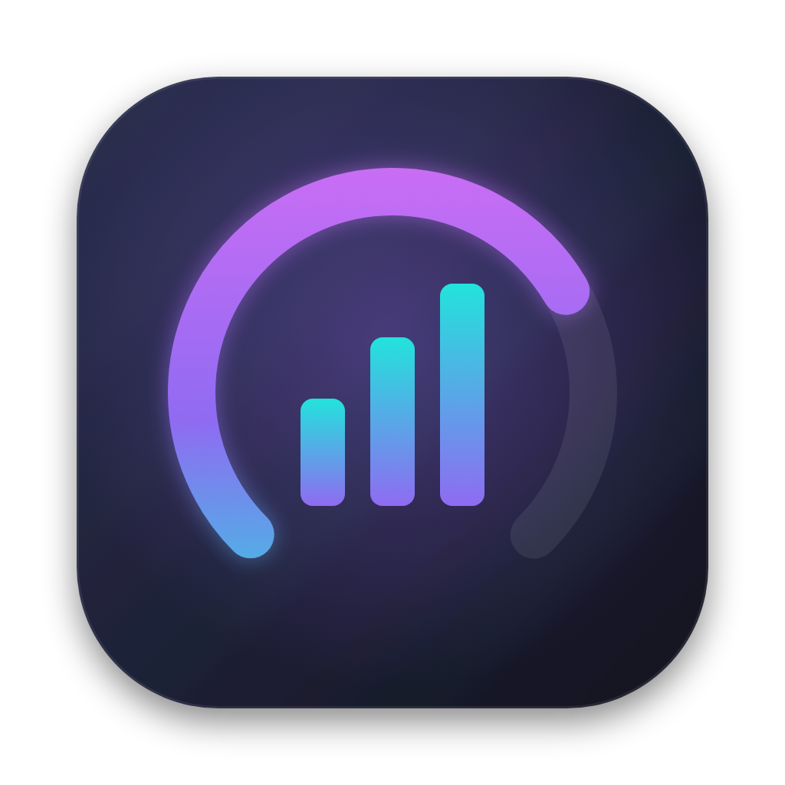

# Token Tracker

A small macOS app that shows, in real time, how many tokens you have left in Claude Code.



- **5-hour window left**: % remaining, tokens used and a countdown to the reset
- **Context left**: how full your current session's context window is
- **Burn rate and "Runs out"**: tokens per minute and when you'd hit the limit at that pace
- Tokens per hour (24h), by model, by weekday, and recent sessions
- **Menu bar** readout of % left, which keeps tracking when the window is closed
- Keep on top (⌘T), Open at Login

Updates are pushed within about 1 second of Claude Code writing a message.

## Privacy
Everything runs locally. It reads only the token counts in `~/.claude/projects/**/*.jsonl`,
never prompts or responses, and sends nothing anywhere.

## Install
Download `Token Tracker.dmg` from Releases, open it and drag the app into Applications.
It needs macOS 13+ and Python 3 (included with the Xcode Command Line Tools).
The app is not notarized, so right-click it and choose **Open** the first time.

## Run without building
```bash
python3 token_meter.py          # your real data, opens a small window
python3 token_meter.py --demo   # fake data, to preview the UI
```

## Build the app
```bash
packaging/build.sh              # creates dist/Token Tracker.app and dist/Token Tracker.dmg
```

## About the 5-hour limit
Anthropic doesn't publish exact token caps for Pro or Max plans, so the % left is an
estimate until you set your own limit by clicking the purple card. The window counts
input, output and cache-write tokens; cache reads are excluded.
